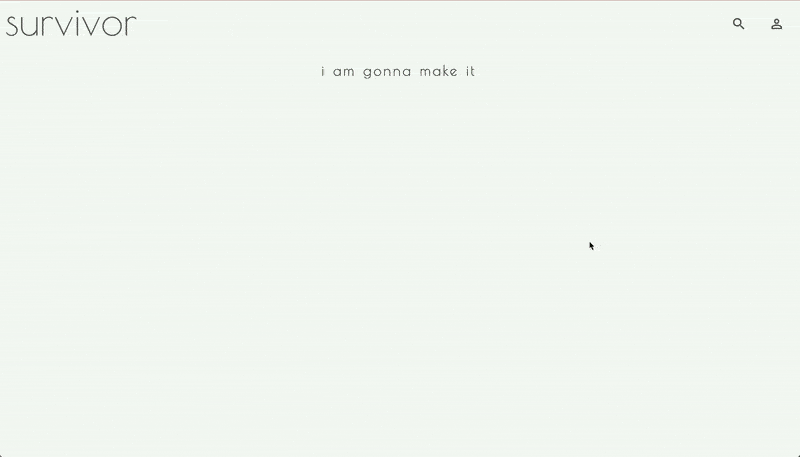

# about

Survivor was created thinking of my own needs. I love plants. I do not know how to take good care of them. I water the plants too much or I do not water them at all. I place them in the sun when they really need to be in the shade. I always think the soil will be eternally good and I will not need to change it. After all these bad experiences some of my plants die and I feel terrible for not being able to take care of a plant.
Survivor was thought to be like a bullet journal for plants. You write down all the information you have and you want to be there, this makes it easier to remember and track some important events about your plants.
It's an extra memory.

# features

## home, register or login

Users are welcomed with a landing page and invited to register or login.


## creating a garden

Users can create a garden for the plants. They should choose a name and click in create.


## adding a plant

After creating a garden, users navigate through the garden and they can delete the garden or add a plant. Adding a plant uses the following steps: choose a name, add notes and a picture (optional), choose how often water the plant.


## editing a plant

When clicking in a plant, a modal will appear allowing the user to edit the plant. Users can edit all plant information.


## opening a garden

By clicking on a garden, users will see all the plants that belong to that garden. Plants that are labeled "I am thirsty" needs to be watered. Clicking on the label will remove the "need to be water" status from this plant.


## watering a plant

On the drop icon on the header, users can navigate to the waterings page. The waterings page contains all the plants that needs to be watered. Clicking on the "you dit it" button will remove the "need to be water" status from this plant. When all the plants are watered, the blue circle around the drop icon will disappear. It means there is no more plants to be watered and the user should come back on the next day.


## searching for a plant

Clicking on the search icon allows users to search and get information about plants.



# technologies

-   React
-   AWS
-   Node.js
-   Express.js
-   PostgreSQL

# instructions

you need an AWS account to run the Survivor.

1.  clone repository

    ```bash
    git clone https://github.com/ingriddorioschulze/survivor
    cd survivor
    ```

2.  install dependencies

    ```bash
    npm install
    ```

3.  setup database

    you need PostgreSQL at least version 9 and your system user needs to be able to access the server without a password.

    ```bash
    createdb survivor
    cd sql
    psql -d survivor -f users.sql
    psql -d survivor -f garden.sql
    psql -d survivor -f plants.sql
    psql -d survivor -f search_plants.sql
    psql -d survivor -f waterings.sql
    ```

4.  create S3 bucket and credentials

    go to the AWS console and create a S3 bucket in the eu-west-1 region. in the bucket create a folder named as you want.

    the bucket and folder name need to be exchanged in the s3.js file with the one you created.

    in AWS IAM create security credentials for a user that can write to the new bucket and put the access key and secret into a file called secrets.json.

    ```json
    {
        "AWS_KEY": "YOUR AWS KEY",
        "AWS_SECRET": "YOUR AWS SECRET"
    }
    ```

5.  start the application and the bundle server

    ```bash
    npm start
    ```

    in a new terminal

    ```bash
    node bundle-server.js
    ```

    now go to http://localhost:8080 in your browser

# coming soon features

-   tests
-   more watering options
-   options to track soil, light, humidity, fertilizer, temperature, pot and so on.
-   add plants from the search to a existing garden
-   mobile version
-   improve responsive design

# credits

Images:

-   Google Images
-   House Plant 411
